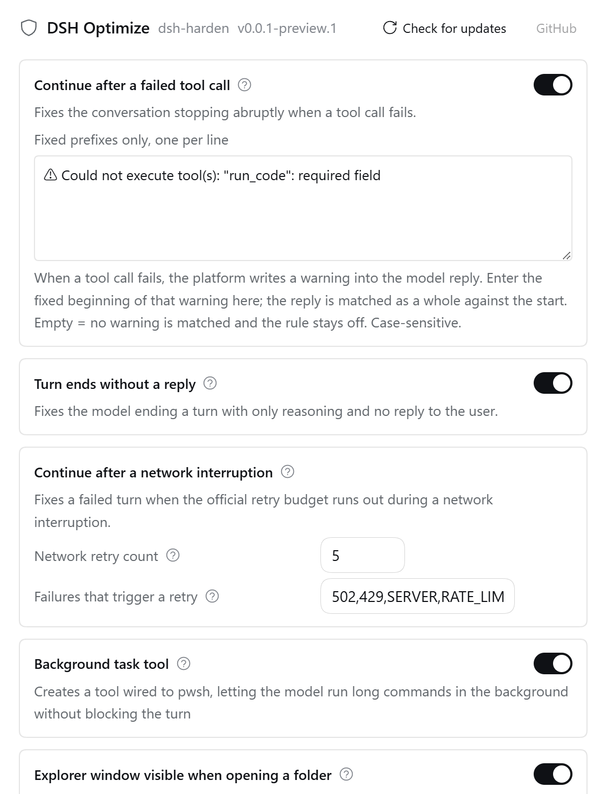
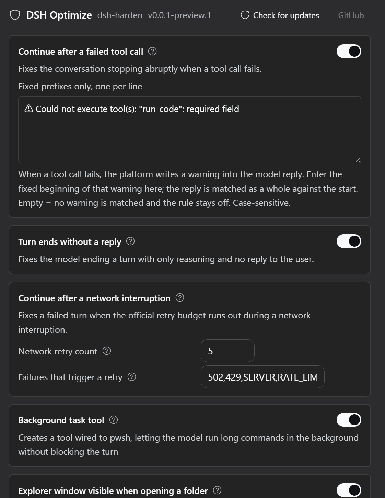

# dsh-harden

<p align="center">
  <a href="https://www.npmjs.com/package/dsh-harden"></a>
  <a href="https://github.com/thissensen/dsh-harden/actions/workflows/ci.yml"></a>
  <a href="https://github.com/thissensen/dsh-harden/releases"></a>
  <a href="./LICENSE"></a>
</p>

<p align="center">
  <b>A runtime hardening layer for DSH — every stop must have a clear reason</b>
</p>

<p align="center">
  <a href="./README.md">中文</a> ·
  <a href="https://github.com/thissensen/dsh-harden">GitHub</a>
</p>

> **Status**: guard rules H1, H2 and H3 are all implemented; **all 50 tests pass**, typecheck is clean, and the build succeeds.

## What it solves

A model turn should **fail loudly** when something goes wrong. But sometimes a failure is swallowed by the framework, the turn **looks like it completed normally** — and the conversation stalls with no visible explanation.

dsh-harden attaches to key points in the agent lifecycle and catches these **silent failures**.

| Case | Today |
|---|---|
| API expired / rate-limited (429), explicit failure after retries are exhausted | ✅ The platform already does this, and users **accept** it |
| A tool call fails but is swallowed, and the turn "looks like" it completed | ✅ **Covered by this project** |
| A turn's last step emits only reasoning, with neither reply text nor a tool call | ✅ **Covered by this project** |
| A network request is interrupted and the official retry budget runs out | ✅ **Covered by this project** |

In one sentence: **an explicit failure is fine; a silent stop is not.**

## Features

- **Continue after a failed tool call** — when a tool call fails and the framework still treats the turn as complete, a note is injected so the model retries.
- **Recover a turn that ends without any reply text** — when the last step has only reasoning, the turn is pulled back for one more step.
- **Continue after a network interruption** — after the official retry budget runs out, the plugin adds extra attempts for the failure kinds you list.
- **Background task tool** — gives the model a `job_background` tool to run long commands in the background without blocking the turn.
- **Open folder takeover** — fixes the platform bug where "Open with → Explorer" did nothing. Load/unload it any time from the settings page: while loaded only Explorer is offered; unload to bring every official launcher back.
- **Unbounded and switchable** — no cap on injections, and every rule has its own toggle.
- **Never touches your config or patches the platform** — switches live in the platform `settings`; it only listens to public events and patches no `@deepseek-ai/*` package.

## Screenshots

<p align="center">
  
  
</p>

## Install

Pick one of the three routes, then register the plugin in a profile — that step is required (see below).

### 1. From npm

```bash
npm install dsh-harden
```

### 2. From a GitHub Release

Download `dsh-harden-<version>.tgz` from [Releases](https://github.com/thissensen/dsh-harden/releases):

```bash
dsh plugin --profile web add file:<absolute path to the .tgz>
```

### 3. From source

```bash
git clone https://github.com/thissensen/dsh-harden.git
cd dsh-harden
pnpm install
node scripts/link-deps.mjs    # link host packages into this project's node_modules
pnpm build                     # tsc (host) + vite (client)
```

The first build must finish before DSH starts (the client shell is bound by the DSH startup snapshot).

## Register in a profile

The routes above only put the files in place; you still have to register `dsh-harden` in a profile so DSH loads it at startup.

**Desktop**: edit `~/.dsh/profiles/desktop/package.json` by hand in two places:

1. add `"dsh-harden": "link:<absolute path to this repo>"` to `dependencies` (use a version range if you installed from npm);
2. add `"dsh-harden"` to the `dsh.profile.bundles` array.

Then run `pnpm install` in that directory and **restart the desktop app**.

**Web**: one CLI command

```bash
dsh plugin --profile web add link:<absolute path to this repo>
```

## Settings

The settings page lives under the "DSH Optimize" section and has five cards:

| Card | Description |
|---|---|
| **Continue after a failed tool call** | Toggle. A swallowed tool-call failure that still ends the turn as "complete" causes a note to be injected so the model retries. Also has **Failure warning prefixes**: the fixed opening of the platform warning, matched per line at the start, case-sensitive. **Empty by default — empty means rule H1 stays off.** Example: `⚠ Could not execute tool`. |
| **Turn ends without a reply** | Toggle. A turn whose last step has only reasoning is pulled back for one more step. |
| **Continue after a network interruption** | Toggle plus **Network retry count** (0–99 extra attempts after the official retries run out; 0 disables it) and **Failures that trigger a retry** (failure codes `SERVER` / `RATE_LIMIT` / `TIMEOUT` / `TRANSPORT` and HTTP statuses `502` / `429`; empty retries nothing). |
| **Background task tool** | Toggle. When on, the model can start background commands with `job_background` and manage them with `job_list` / `job_output` / `job_kill`. When off, the tool disappears. |
| **Open folder takeover** | Load / Unload button. While loaded, the plugin takes over opening folders so "Open with → Explorer" pops up a window; the official launchers (VS Code, Cursor, Git Bash, Windows Terminal, …) are unavailable. Unload to bring every official launcher back. After switching, a dialog reminds you to restart the DSH desktop app, because the change only takes effect after a restart. |

> ⚠️ **The one that matters most**: **"Failure warning prefixes" is empty by default, so leaving it blank after install means rule H1 is off.** Open the settings page and paste the fixed beginning of your platform's warning text (example: `⚠ Could not execute tool`).

## Development

```bash
pnpm install
node scripts/link-deps.mjs    # link host packages into this project's node_modules
pnpm build                     # tsc (host) + vite (client)
pnpm typecheck                 # type check only
pnpm test                      # vitest, 50 tests
```

## Design

- **Public platform events only.** Rules H1 (failed tool call) and H2 (turn without a reply) hang on the serial `agent/turn-stopping` hook: as the turn is about to close it reads the last step's text, and on a hit calls `agent.steer()` to re-inject guidance. Rule H3 hangs on the waterfall `agent/request-error`: it first `await next()` so the official retry decides, and only steps in after that gives up.
- **Unbounded guard rules.** A hit injects a correction note with no cap; a single counter is kept for logging only.
- **Absent means do not interfere.** Unreadable configuration falls back to defaults; the plugin mounts without optional services.

## License

[MIT](./LICENSE)
