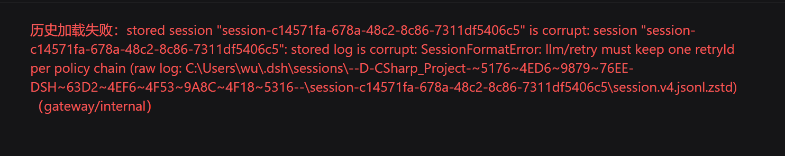
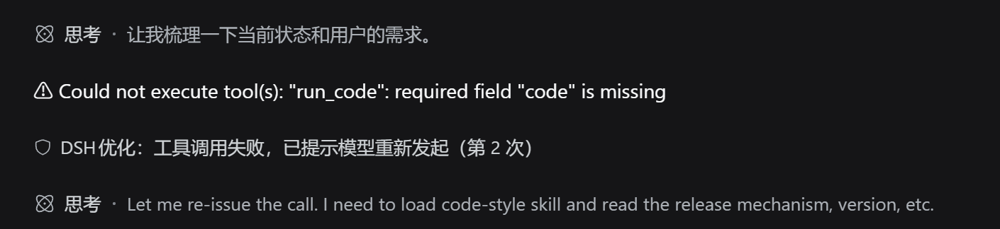
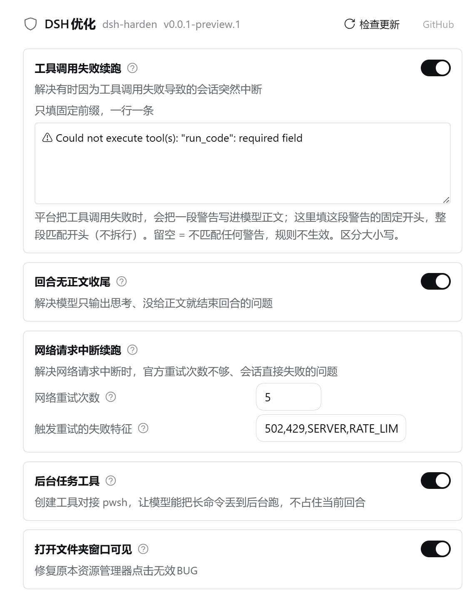
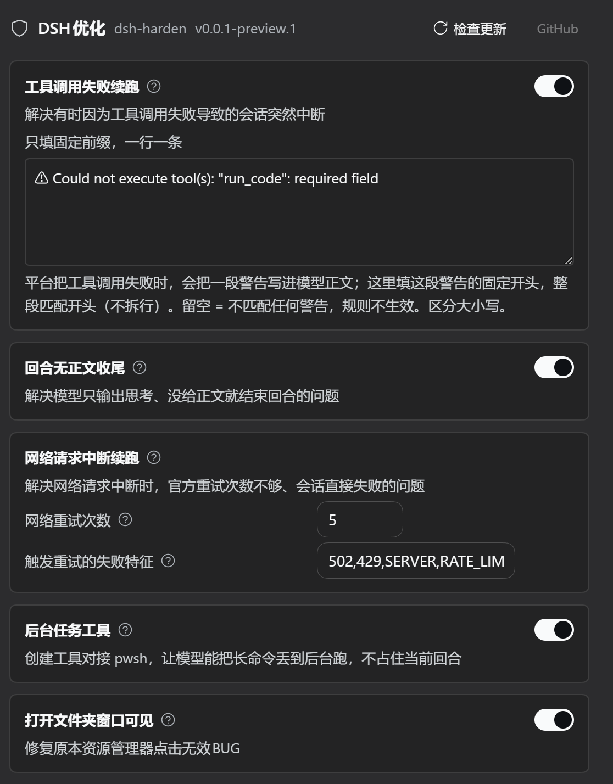

# dsh-harden

<p align="center">
  <a href="https://www.npmjs.com/package/dsh-harden"></a>
  <a href="https://github.com/thissensen/dsh-harden/actions/workflows/ci.yml"></a>
  <a href="https://github.com/thissensen/dsh-harden/releases"></a>
  <a href="./LICENSE"></a>
</p>

<p align="center">
  <b>DSH 运行时看护层 —— 让任何一次停止都有明确原因</b>
</p>

<p align="center">
  <a href="./README.en.md">English</a> ·
  <a href="https://github.com/thissensen/dsh-harden">GitHub</a>
</p>

## 插件用途

1. API由于特殊原因导致的调用失败后，可续接并自动重试

2. 工具调用失败被吞导致会话莫名结束

3. 第三方API经常出现的：只输出思考直接中断，插件会自动重试

4. 创建对接pwsh的后台job工具，解决只使用gitbash无法创建超120秒的后台任务

5. 一键修复异常会话日志

6. 上下文自动压缩 —— 会话涨到阈值自动把老历史压成摘要，界面沿用平台自带提示；压缩范围另有下拉框三档可选（全部压缩 / 仅主代理 / 仅子代理，默认全部压缩）

## 问题截图

会话日志被写坏后，平台会直接报错、整段历史再也打不开；插件在设置页提供一键扫描并修复：

<p align="center">
  
</p>

工具调用失败被吞时，插件自动提示模型重新发起，回合不会莫名结束：

<p align="center">
  
</p>

模型只输出思考、没有正文就收尾时，插件自动提示模型补充正文，回合不会莫名结束：

<p align="center">
  
</p>

## 插件截图

<p align="center">
  
  
</p>

## 安装

### 1. 从 npm 安装

```bash
npm install dsh-harden
```

### 2. 从 GitHub Releases 下载

到 [Releases](https://github.com/thissensen/dsh-harden/releases) 下载 `dsh-harden-<版本>.tgz`：

```bash
dsh plugin --profile web add file:<tgz 文件的绝对路径>
```

### 3. 从源码构建

```bash
git clone https://github.com/thissensen/dsh-harden.git
cd dsh-harden
pnpm install
node scripts/link-deps.mjs    # 把宿主包链进本项目的 node_modules
pnpm build                     # tsc（host）+ vite（client）
```

首次构建必须在启动 DSH 之前完成（client 壳受启动快照约束）。

## 开发

```bash
pnpm install
node scripts/link-deps.mjs    # 把宿主包链进本项目的 node_modules
pnpm build                     # tsc（host）+ vite（client）
pnpm typecheck                 # 只做类型检查
pnpm test                      # vitest，100 例
```

## 许可

[MIT](./LICENSE)
